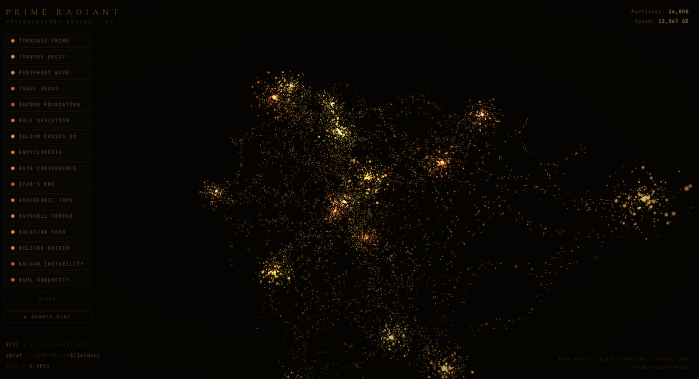

# Prime Radiant

**A hyperdimensional data visualization engine inspired by the Prime Radiant from Isaac Asimov's *Foundation* series.**



## What is this?

Prime Radiant is an open-source, browser-based visualization engine that renders data as a living organism of golden particles. Inspired by the Prime Radiant device from Apple TV+'s *Foundation* — where Hari Seldon's psychohistory equations float as luminous particles in space — this engine creates an immersive, interactive experience for exploring complex data relationships.

**32,000 particles. Zero lines. Pure light.**

## Features

- **Hyperdimensional structure** — 16 data nodes positioned on interlocking tori and helices, as if a 4D structure projected into 3D space
- **Helical connections** — Nodes connected by spiral paths that orbit through space, not flat lines
- **Organic swarming** — Every particle moves with flocking behavior, creating a living, breathing organism
- **10,000 traveler particles** — Constantly flowing along helical paths between nodes, forming visible rivers of light
- **Ceremonial opening** — Touch-to-initiate animation where the entire structure materializes from a central point
- **Interactive navigation** — Orbit, pan, zoom. Click clusters to focus. Filter by node.
- **Growth demo** — Watch new branches grow organically from existing nodes
- **Single HTML file** — No build step, no dependencies to install. Just open and go.

## Quick Start

1. Download `index.html`
2. Open in any modern browser
3. Touch the sigil to initiate
4. Explore: drag to orbit, scroll to zoom, right-click to pan, double-click a cluster to focus

Or visit the live demo: **[your-github-pages-url]**

## How It Works

### Structure
Nodes are positioned on two interlocking tori (6 + 5 nodes) plus a helix that spirals through the center (5 nodes). This creates a structure that looks different from every angle — like a tesseract projected into 3D.

### Connections
Every connection between nodes is a helical path — a spiral that curves through space with 1.5-3 full rotations. 10,000 traveler particles flow along these helices, creating visible rivers of light between data clusters.

### Particles
- **Core** (5,500) — Dense, bright swarms at each node
- **Halo** (2,500) — Soft outer glow around nodes
- **Travelers** (10,000) — Flow along helical connections
- **Branch static** (3,000) — Dim backbone glow along paths
- **Dust** (5,000) — Ambient atmosphere
- **Reserve** (6,000) — Available for growth demos

### Animation
Every particle has individual velocity, home-strength, and speed parameters. Core particles swarm around their node with organic spiral motion. Travelers follow helical paths and occasionally jump between branches. The result is a visualization that never looks the same twice.

## Use It With Your Data

The engine uses a simple cluster/connection model. To adapt it for your data:

```javascript
// Define your clusters (nodes)
const CL = [
  { name: 'Your Node 1', prob: 0.95, pop: '1.2M', trend: '+0.01/yr' },
  { name: 'Your Node 2', prob: 0.73, pop: '500K', trend: '-0.02/yr' },
  // ...
];

// Node positions are computed automatically on interlocking tori.
// Connections are generated between nearby nodes.
// Customize colors via the CCC array.
```

### Potential Applications
- **Network visualization** — Social graphs, infrastructure topology
- **Real-time data streams** — Connect to SSE/WebSocket feeds (Wikipedia, GitHub, IoT)
- **Knowledge graphs** — Research papers, linked documents
- **OSINT / Geopolitics** — Event streams from GDELT or similar
- **Portfolio dashboards** — Financial data as living organisms
- **Art installations** — Generative art, museum exhibits

## Tech Stack

- **Three.js** (r128) — WebGL rendering
- **Custom GLSL shaders** — Point sprites with adaptive glow, organic falloff
- **Additive blending** — Particles sum to create luminous density
- **Pure vanilla JS** — No frameworks, no build tools

## Controls

| Action | Desktop | Mobile |
|--------|---------|--------|
| Orbit | Left-click drag | One finger drag |
| Pan | Right-click drag / Shift+click | Two finger drag |
| Zoom | Scroll wheel | Pinch |
| Focus node | Double-click | — |
| Filter | Click cluster buttons | Click cluster buttons |

## Browser Support

Works in any browser with WebGL support. Tested on Chrome, Safari, Firefox, Edge. Performance is best on devices with dedicated GPUs. On mobile, works smoothly on recent iPhones and iPads.

## License

MIT License — use it for anything.

## Credits

Created by [Víctor Estrugo](https://victorestrugo.com)

Inspired by the Prime Radiant from Isaac Asimov's *Foundation* series and its stunning visualization in the Apple TV+ adaptation.

Built with [Three.js](https://threejs.org/).

---

*"The Prime Radiant can be manipulated mentally. It adjusts all the equations... in response to the changing conditions."* — Isaac Asimov, Foundation and Empire
